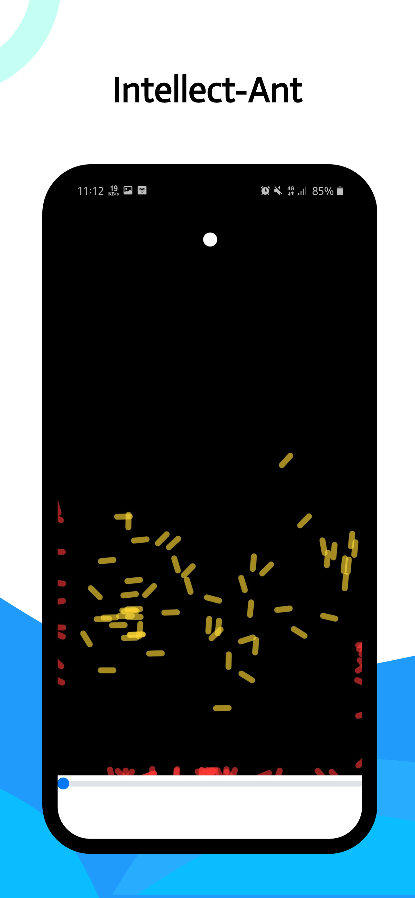
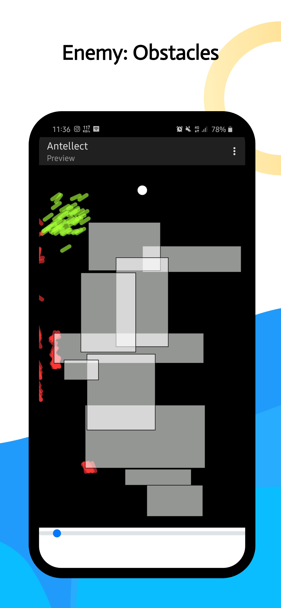

  

<h1 align="center">Antellect🐜</h1>

 -Intellect,Ant.

---

## 🌱 What does it do?

- 💻 **Antellect** is an application of Genetic Algorithm on Ants to reach the Target(Marshmallow).

- 🌱 It is created using **Javascript** and **p5.js**(framework)

- 💬 Ping me about **Anything**, I'm glad to help you!😇

- ⚡ Fun fact: It is created in mobile code editor and in-browser IDE of p5.js.

---

## 🏁 Getting Started 

- First thing first, open the https://amishranpariya.github.io/Antellect/ in any of your favourite browser.
- Now, there are some points to remember.
- Colour of ant show the state of its life (Green to Red is for Born to Die).
- First you can sit and watch how the Ants are learning in default speed.
- Or you can speed up the process to see the evolution of ants rapidly(upto 100x) using the slider below the field.
- Most importantly you can also add some obstacles in the field. (For that just draw rectangle as in any paint tool or photoshop ie. Touch-Drag-Lift or MouseDown-Drag-MouseUp).
- The ant will die if it hits the wall or obstacles.

---

## 🔬 Technical stuff (How it works)

- Single word answer **"Genetic Algorithm"** 🧐.

- More elaborately, there is a colony of Ants of population 100 ants in each generation of colony🐜.
- Each Ant have their own DNA.
- DNA contain the 1000 directions in which direction the ant will go in its lifetime(Here lifetime will be 1000 Frames)(Basically DNA is an array of vectors, **n** th vector tells the direction to which the ant will go on **n** th frame).
- The ant will die ☠️ if it hits the walls or obstacles.
- When all ants of a colony die we give each ant a fitness score.(Nearer to the Target more⬆️ the score, Reaching the target give extra💎 score, Dying before the reaching the target implies score deducted⬇️).
- If two ants reach the target then the one which reached in less time will be awarded more score(this is useful for shortest path).
- Now we are going to generate a new Generation (Colony).
- For this we first choose two ants to be parent of next generation ant.(For each new ant, 2 ants were chosen -it may or may not be same parent).
- The probability of an ant to be chosen as parent is depend upon the fitness score of that ant(more the fitness score more the probability).
- After choosing parent for each new ants we crossover the Parent's DNA and make new DNA and also add some Mutation for optimal path finding (in our words to add creativity in ants).
- Here crossover means we take some portion of DNA array from parent A and some portion of DNA array from parent B and then join it(new[0-999]=A[0-493]+B[494-999]).
- 10% Mutation changes roughly the 10% of the DNA array to random vectors.(It brings new possibilities of finding shortest path).
- Now these new DNA are given to the ants of new colony.
- Now the process start again from above ( Born - wandering - reaching/dying - giving score - making new DNAs - Born of next generation🔄).
- This way after some generation the ants start learning to reach the Marshmallow 😁.
- No wonder, it's the same thing as human evolution 🤔.

---

## What next?
#### Efficiency of learning should be improved.
- How? 
- Using efficient cross-over method.
- Using Suitable scoring system.
- Tweaking the Mutation rate.
- Also making matingpool have best ant of previous 5-6 generations(multilevel genetic algorithm).

#### Appearance of program expected to be improved.
- How?
- Adding polygon Obstacles.
- Making obstacles removable.
- Making target replaceable. 
- Other features like saving best ant's DNA on localstorage or server. 
### Accepting pull request for all above aspects also share your own version.

---

## ⛏️ Built Using

- [p5.js](https://p5js.org/) - Framework

- [p5.js](https://editor.p5js.org/) - editor

---

## 🎉 Acknowledgements 

- Inspired by *Smart Rockets* project.

---

#### Show some ❤️ by starring some of the repositories!

---
